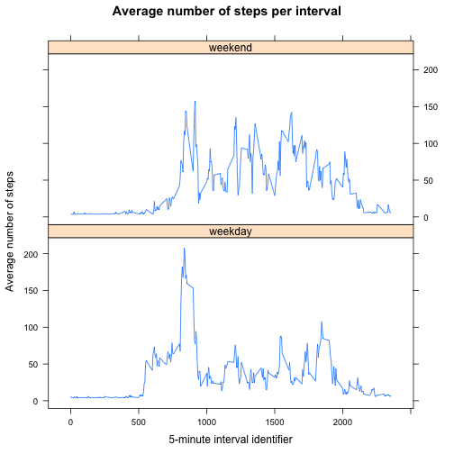

## Introduction
This is my reproducible markdown script for peer assignment 1 of the Coursera course Reproducible Research.

[Course reference URL](https://class.coursera.org/repdata-016/human_grading/view/courses/972599/assessments/3/submissions)

It is now possible to collect a large amount of data about personal movement using activity monitoring devices such as a Fitbit, Nike Fuelband, or Jawbone Up. These type of devices are part of the “quantified self” movement – a group of enthusiasts who take measurements about themselves regularly to improve their health, to find patterns in their behavior, or because they are tech geeks. But these data remain under-utilized both because the raw data are hard to obtain and there is a lack of statistical methods and software for processing and interpreting the data.

This assignment makes use of data from a personal activity monitoring device. This device collects data at 5 minute intervals through out the day. The data consists of two months of data from an anonymous individual collected during the months of October and November, 2012 and include the number of steps taken in 5 minute intervals each day.

## Part 1 loading and preprocessing the data
We loaded and pre-processed the data.  As an R project is being used, the working directory is set automatically to the directory containing the R project which is in the root of the repository containing this R Markdown file and the zipped data file.  As such we don't need to change the working directory.

```r
zipFile <- "./activity.zip"
unzip(zipFile, exdir = "./")
activityData <- read.csv("./activity.csv")
```

And then we cast the date variable from a factor to a date

```r
activityData$date = as.Date(as.character(activityData$date), "%Y-%m-%d")
```

From the data frame we can see there are three variables:

```r
str(activityData)
```

```
## 'data.frame':	17568 obs. of  3 variables:
##  $ steps   : int  NA NA NA NA NA NA NA NA NA NA ...
##  $ date    : Date, format: "2012-10-01" "2012-10-01" ...
##  $ interval: int  0 5 10 15 20 25 30 35 40 45 ...
```

The variables are:

1.   `steps`: an integer variable that is the number of steps taking in a 5-minute interval (of which 2304 missing values are coded as NA)
2.   `date`: a date variable that is the date on which the measurement was taken in YYYY-MM-DD format
3.   `interval`: an integer variable that is the identifier for the 5-minute interval in which measurement was taken

There are a total of 17568 observations in this dataset.

## Part 2 what is mean total number of steps taken per day?
From the instructions we can ignore the missing values in the dataset. We are to:

1.  Make a histogram of the total number of steps taken each day.
2.  Calculate and report the mean and median total number of steps taken per day

We aggregated the data summing up the steps for each day and ploted a histogram of the total number of steps taken each day:

```r
totalDaily <- aggregate(steps ~ date, data = activityData, FUN = sum, na.rm=TRUE)
hist(totalDaily$steps, main = "Historgram of the total number of Steps taken each day"
      , xlab = "Buckets of total steps")
```

 

And the mean and median (to one decimal place) of the total number of steps taken per day:
the mean is **10766.2 ** and 
the median is **10765.0 **

## Part 3 what is the average daily activity pattern?
We are to:

1.  Make a time series plot (i.e. type = "l") of the 5-minute interval (x-axis) and the average number of steps taken, averaged across all days (y-axis)
2.  And answer which 5-minute interval, on average across all the days in the dataset, contains the maximum number of steps?

We aggregated the data averaging the steps for each interval and plotted the data:

```r
meanInterval <- aggregate(steps ~ interval, data = activityData, FUN = mean, na.rm=TRUE)
plot(meanInterval$interval, meanInterval$steps, type = "l", main = "Average number of steps per interval"
     , xlab = "5-minute interval identifier", ylab = "Average number of steps")
```

 

The 5-minute interval that contains the maximum number of steps is interval **835** and the maximum number of steps was **206.2**

## Part 4 imputing missing values
From the activity data there are 2304 missing values coded as NA.  As the missing values may bias some calculations or data, we are to:

1.  Calculate and report the total number of missing values in the dataset (i.e. the total number of rows with NAs)
2.  Devise a strategy for filling in all of the missing values in the dataset.
3.  Create a new dataset that is equal to the original dataset but with the missing data filled in.
4.  Make a histogram of the total number of steps taken each day.
5.  Calculate and report the mean and median total number of steps taken per day.
6.  Answer do these values differ from the estimates from the first part of the assignment? What is the impact of imputing missing data on the estimates of the total daily number of steps?

To determine a method for imputing the missing values I made use of the reference material, ["How to Identify and Impute Multiple Missing Values using R." By Dr. Jon Starkweatherhttp](//www.unt.edu/rss/class/Jon/Benchmarks/MissingValueImputation_JDS_Nov2010.pdf)

There are 2304 missing values coded as NA.

We chose using the rrcovNA package and used the impSeq function to impute the missing values.  Many of the other packages and functions in the above reference did not work well with this data set.  For example the VIM package irmi function generated negative values for the number of steps for a given interval.

We created a new data set that contains the imputed values using our chosen method.  As impSeq returns a matrix, we will cast it to a data frame and convert values for the date field back to the correct date values instead of keeping them as an integer.

```r
library(rrcovNA)
imputedData <- impSeq(activityData)
imputedData <- data.frame(imputedData)
imputedData$date = as.Date(imputedData$date, origin = "1970-01-01")
```

We plotted a histogram of the total number of steps taken each day using the imputed data set by aggregating the data by summing up the steps for each day:

```r
totalImputedDaily <- aggregate(steps ~ date, data = imputedData, FUN = sum, na.rm=TRUE)
hist(totalImputedDaily$steps, main = "Historgram of the total number of Steps taken each day"
      , sub = "with missing values imputed using impSeq() in the rrcovNA package"
      , xlab = "Buckets of total steps")
```

 

The mean and median total number of steps taken per day using the imputed data set (to one decimal place):
the mean is **10767.2 ** and 
the median is **10781.1 **

We can see that the mean, median, and quantiles have changed while the min and max have not:

```r
summary(totalDaily)
```

```
##       date                steps      
##  Min.   :2012-10-02   Min.   :   41  
##  1st Qu.:2012-10-16   1st Qu.: 8841  
##  Median :2012-10-29   Median :10765  
##  Mean   :2012-10-30   Mean   :10766  
##  3rd Qu.:2012-11-16   3rd Qu.:13294  
##  Max.   :2012-11-29   Max.   :21194
```

```r
summary(totalImputedDaily)
```

```
##       date                steps      
##  Min.   :2012-10-01   Min.   :   41  
##  1st Qu.:2012-10-16   1st Qu.: 9819  
##  Median :2012-10-31   Median :10781  
##  Mean   :2012-10-31   Mean   :10767  
##  3rd Qu.:2012-11-15   3rd Qu.:12811  
##  Max.   :2012-11-30   Max.   :21194
```

Depending on the purpose for which we calculated this data, how the missing values were imputed can have an effect on the outcome. If we used a method that significantly changed the quantiles, mean, or median, we might end up with different conclusions.

## Part 5 are there differences in activity patterns between weekdays and weekends?
Using the data set with imputed values we are to:

1.  Create a new factor variable in the dataset with two levels – “weekday” and “weekend” indicating whether a given date is a weekday or weekend day.
2.  Make a panel plot containing a time series plot (i.e. type = "l") of the 5-minute interval (x-axis) and the average number of steps taken, averaged across all weekday days or weekend days (y-axis).

We added a new variable and set the value based on the date variable value and then converted it to a factor variable

```r
imputedData$WeekDay <- ifelse((weekdays(imputedData$date) == "Sunday" | weekdays(imputedData$date) == "Saturday")
                              , "weekend", "weekday")
imputedData$WeekDay = factor(imputedData$WeekDay, levels = c("weekday", "weekend"))
```

We aggregated the data averaging the steps for each interval and plotted the data:

```r
library(lattice)
meanWDay <- aggregate(steps ~ interval+WeekDay, data = imputedData, FUN = mean, na.rm=TRUE)
xyplot(steps ~ interval | WeekDay, data = meanWDay, type = "l", layout = c(1,2)
       , main = "Average number of steps per interval"
       , xlab = "5-minute interval identifier", ylab = "Average number of steps")
```

 

